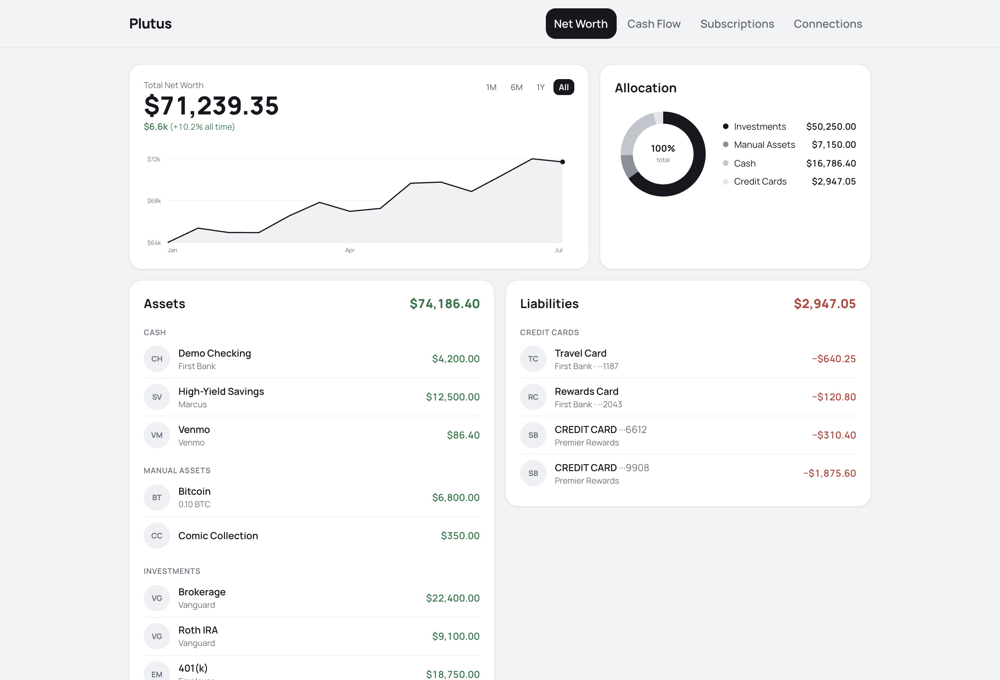
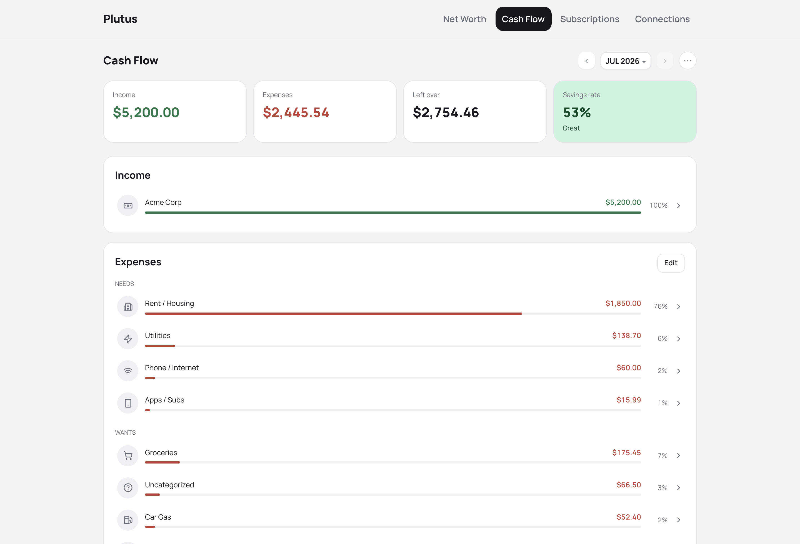
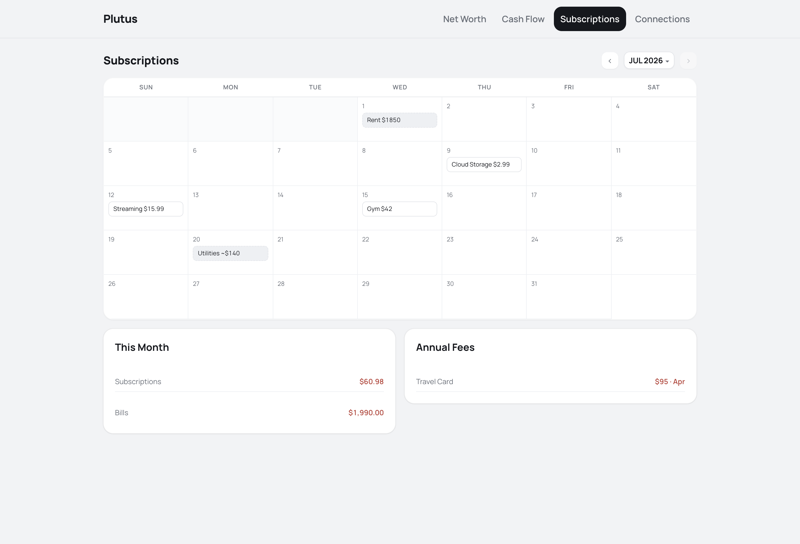
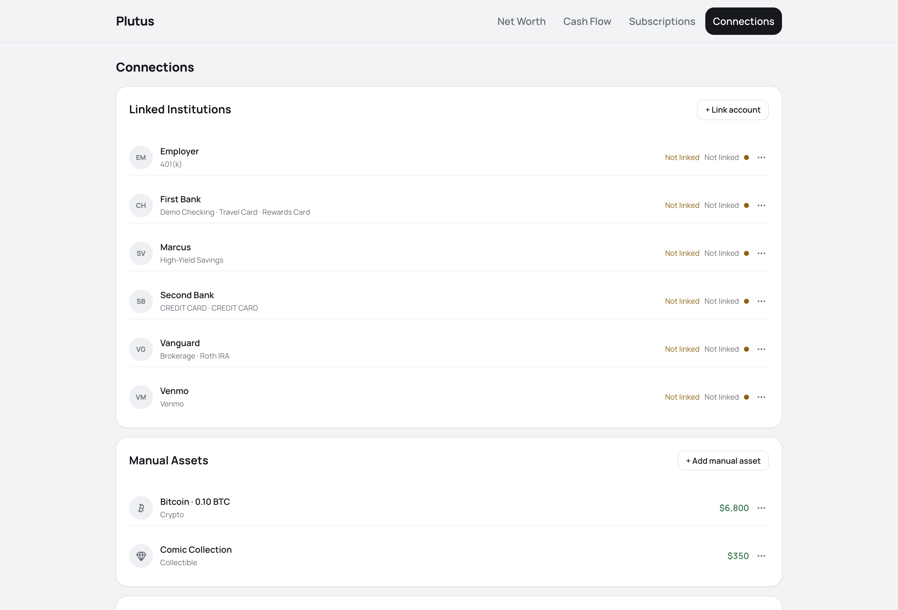

# Plutus



Plutus is a free, open-source, self-hosted net worth and cash flow tracker. It runs entirely on your own machine with your own Plaid keys — your financial data never leaves it, and nobody hosts anything for you.

Four tabs: **Net Worth · Cash Flow · Subscriptions · Connections**. Cash Flow derives itself from synced transactions — income, needs, wants, savings, and a spending grade — with zero configuration; drill into any line for its underlying transactions.

It has a Next.js frontend and API in one process, an encrypted SQLite database (SQLCipher), and Plaid for read-only bank sync.

<details>
<summary>More screens (Cash Flow · Subscriptions · Connections)</summary>

| Cash Flow | Subscriptions | Connections |
|---|---|---|
|  |  |  |

</details>

## Contents

- `app/` - Next.js App Router pages and API routes
- `components/` - views and UI primitives (shadcn/Radix, token-based design system)
- `lib/` - database layer and migrations, Plaid sync, cash-flow derivation, secrets
- `lib/seed-config.ts` - fake demo data used by demo mode
- `scripts/cli.ts` - ops CLI: `sync`, `snapshot`, `categorize`, `categorize-ai`, `month-close`, `month-new`
- `scripts/backup-db.ts` - encrypted single-file backup (`pnpm backup`, keeps the last 8)

## Prerequisites

- Node.js 20 or newer
- pnpm
- git
- macOS, for now — secrets live in the Keychain; a cross-platform `.env` secrets path and Docker are on the roadmap
- A Plaid account (free plan, 10 institution connections) — you bring your own keys
- Optional: an Anthropic API key for AI merchant categorization

## Database Setup

Nothing to run. On first boot Plutus creates an encrypted SQLite database at `~/FinanceTracker/finance.db` — the key is generated once and stored in the Keychain, the file is `chmod 600` — and migrates it automatically. Migrations are idempotent; existing databases upgrade in place on the next boot.

Backup is copying one file: `pnpm backup` writes an encrypted copy to `~/FinanceTracker/backups/` and keeps the last 8.

Demo mode uses a separate `~/FinanceTracker/demo.db` seeded from `lib/seed-config.ts` — fake data, safe to explore or develop against.

## Environment

Secrets go in the macOS Keychain:

```bash
security add-generic-password -a "$USER" -s finance-plaid-client-id -w '<client_id>'
security add-generic-password -a "$USER" -s finance-plaid-secret -w '<secret>'
# optional: 'sandbox' (default) or 'production'
security add-generic-password -a "$USER" -s finance-plaid-env -w 'production'
# optional: enables AI merchant categorization
security add-generic-password -a "$USER" -s finance-anthropic-key -w '<key>'
```

Optional environment variables:

```bash
PORT=8420                  # server port (default 8420, always bound to 127.0.0.1)
FT_DEMO=1                  # demo mode: fake seeded data in a separate demo.db
FT_AI_MODEL=claude-opus-5  # override the categorization model
ANTHROPIC_API_KEY=...      # alternative to the Keychain entry
```

The Anthropic key is only needed for `categorize-ai`; without one the command is a clean no-op and rules-based categorization still works.

## Plaid Integration

Plutus syncs balances and transactions through Plaid with **your** keys — no shared server, no middleman seeing your data.

1. Sign up at https://dashboard.plaid.com/signup. The free plan includes 10 Items — an Item is one institution login (one bank login covering several cards = 1 Item).
2. Copy the `client_id` and secret from the dashboard's Keys page into the Keychain (above).
3. In the app, open **Connections → + Link account**. Your bank credentials go into Plaid's window only — Plutus never sees them. It stores a read-only access token in the encrypted database; read-only tokens cannot move money.

To try the flow without a real bank, set `finance-plaid-env` to `sandbox` and link with Plaid's `user_good` / `pass_good` test login.

Anything Plaid can't reach (crypto, collectibles, cash) is entered as a manual asset with value history, so the net worth graph stays honest.

## Install

```bash
pnpm install
```

## Run Locally

```bash
pnpm dev
```

Open `http://127.0.0.1:8420`.

To poke around with fake data first:

```bash
FT_DEMO=1 pnpm dev
```

Production build:

```bash
pnpm build && pnpm start
```

## First Run

1. Create a 6-digit PIN — stored as a hash in the Keychain, never in the database. The app auto-locks after 15 minutes idle; 5 wrong attempts trigger a 60-second cooldown.
2. Add your Plaid keys (see Environment) and link your institutions from **Connections**.
3. Run a sync from the UI, or `npx tsx scripts/cli.ts sync`.
4. Add manual assets for anything Plaid can't see.
5. Optionally add an Anthropic key and run `npx tsx scripts/cli.ts categorize-ai` to name uncategorized merchants. Every AI answer is saved as an editable rule that applies forward, and the AI only ever sees merchant names — no amounts, dates, or balances.

## Troubleshooting

**The app isn't reachable from another device.** By design. The server binds `127.0.0.1` and rejects any non-localhost Host header. Opt-in LAN access for a phone PWA is on the roadmap.

**`sync` exits 0 but does nothing.** Plaid isn't configured — add the Keychain keys and re-run.

**An institution shows "needs re-auth".** Bank logins expire (`ITEM_LOGIN_REQUIRED`). Open Connections and re-link; it takes about two minutes.

**`categorize-ai` reports a missing API key.** Add `finance-anthropic-key` to the Keychain or set `ANTHROPIC_API_KEY`. Rules-based categorization works without it.

**Not on a Mac?** The current release depends on the macOS Keychain for secrets. Cross-platform `.env` secrets and a Docker image are the next milestone (see Roadmap) — until then Plutus is macOS-only.

## Security

There is no Plutus server, no account to create, and no telemetry. The app binds `127.0.0.1` and rejects any non-localhost request; the database is SQLCipher-encrypted at `~/FinanceTracker/finance.db` with its key in your Keychain, never on disk; your Plaid keys stay on your machine and your bank credentials go only into Plaid's own window. The single optional outbound call beyond Plaid is AI categorization, which is sent merchant name strings and nothing else — no amounts, dates, or balances.

Full detail — data-flow table, auth design, CSRF and CSP specifics, and known limitations — is in [SECURITY.md](SECURITY.md).

One dependency note: `xlsx` (SheetJS) installs from the vendor's CDN tarball rather than npm, which is the channel SheetJS directs users to. It is used only by `scripts/import-sheet.ts`.

## Roadmap

- Portability: `.env` secrets fallback, Linux/Windows, Dockerfile + compose
- Auth v2: password root credential + WebAuthn passkey (Touch ID at localhost); phone Face ID needs an HTTPS origin, so it lands with a TLS option
- Mobile PWA over opt-in `--lan` (host machine must be awake)
- Design-token enforcement gate in CI

## Useful Checks

```bash
pnpm typecheck
pnpm lint
pnpm test
pnpm build
```

## License

MIT — see [LICENSE](LICENSE). Free to use, modify, and redistribute, forever.
